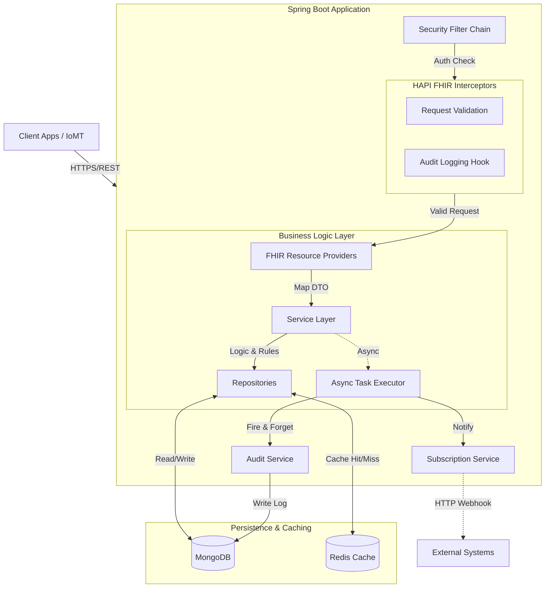
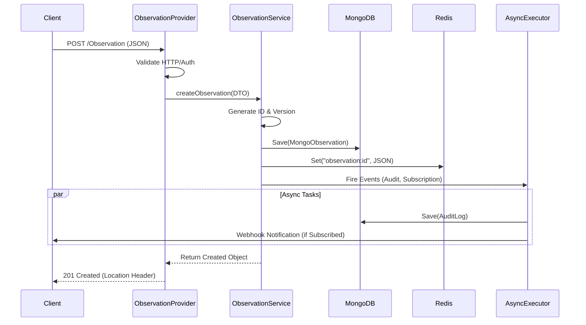

<div align="center">

# LifeLog EHR Backend
### High-Performance Clinical Data Repository (CDR)

[](https://openjdk.org/projects/jdk/21/)
[](https://spring.io/projects/spring-boot)
[](https://redis.io/)
[](https://www.mongodb.com/)
[](https://www.docker.com/)
[](LICENSE)

*Built on the [HL7 FHIR R4](http://hl7.org/fhir/R4/) Standard*

</div>

---

## 📋 Table of Contents
- [Executive Summary](#-executive-summary)
- [Key Features](#-key-features)
- [Architecture & Design](#-architecture--design)
  - [System Architecture](#system-architecture-diagram)
  - [Request Lifecycle](#-request-lifecycle-sequence)
  - [Service Responsibilities](#-service-responsibilities)
- [Technology Stack](#-technology-stack)
- [Getting Started](#-getting-started)
  - [Prerequisites](#prerequisites)
  - [Quick Start](#quick-start-with-docker)
- [API Reference](#-api-reference)
  - [Clinical Resources](#clinical-resources)
  - [Administrative Resources](#administrative-resources)
  - [System](#system-endpoints)
- [Operations Manual](#-operations-manual)
  - [Configuration](#configuration)
  - [Observability](#observability)
  - [Troubleshooting](#troubleshooting)
- [Developer Guide](#-developer-guide)
- [Roadmap](#-roadmap)

---

## 📝 Executive Summary

**LifeLog EHR Backend** is a purpose-built, compliant backend component for modern Electronic Health Record (EHR) systems. It solves the complexity of building a healthcare data platform from scratch by providing a pre-configured **FHIR Facade** that is secure, scalable, and interoperable out of the box.

Unlike traditional SQL-based EHRs, LifeLog leverages **MongoDB** to natively store FHIR JSON documents, offering superior flexibility for diverse clinical data types, while maintaining strict ACID compliance and validation rules.

**Target Use Cases**:
*   **Clinician Dashboards**: Real-time access to patient vitals and history.
*   **IoMT Data Ingestion**: High-throughput writes from wearables.
*   **Patient Portals**: Secure, granular access for patients.

---

## ✨ Key Features

### 🩺 Clinical
*   **Comprehensive Resource Support**: CRUD operations for `Patient`, `Observation`, `Encounter`, `Condition`, `Immunization`, `MedicationRequest`, and more.
*   **Semantic Validation**: Strictly enforces FHIR R4 structure and cardinality.
*   **Advanced Search**: Supports chained parameters (e.g., `subject.name`), dates, and token searches.

### 🛡️ Security & Compliance
*   **Audit Trails**: Asynchronous, immutable logging of every data access (`AuditEvent`).
*   **Optimistic Locking**: Prevents "lost updates" using standard FHIR versioning (`Weak ETag`).
*   **Input Sanitization**: Rejects malformed or unrecognized data structures.

### 🚀 Technical
*   **Event-Driven Architecture**: Non-blocking **Webhooks** (`Subscription`) for real-time integrations.
*   **Write-Through Caching**: **Redis** layer for sub-millisecond read latency on hot data.
*   **Scalable**: Stateless architecture ready for container orchestration (Kubernetes).

---

## 🏗 Architecture & Design

**Style**: Modular Monolith (FHIR Facade)

The system behaves as a protocol translator:
1.  **Ingest**: Receives standard FHIR REST requests.
2.  **Process**: Validates logic, enforces rules, and generates events.
3.  **Persist**: Stores data as optimized Documents (MongoDB) and KV pairs (Redis).

### System Architecture Diagram



### 🔄 Request Lifecycle (Sequence)

How a **POST /Observation** moves through the system:



### 🧠 Service Responsibilities

| Service | Responsibility | Key Interactions |
| :--- | :--- | :--- |
| **PatientService** | Identity Management | Indexed search by Name/Gender. |
| **ObservationService** | Clinical Data Management | High-volume writes, Redis Caching. |
| **SubscriptionService** | Webhooks | Matches `Criteria` (e.g., `code=123`) -> POST to URL. |
| **AuditService** | Compliance | Asynchronous reliable logging. |

---

## 💻 Technology Stack

| Component | Technology | Version | Purpose |
| :--- | :--- | :--- | :--- |
| **Core** | Java | 21 (LTS) | Language |
| **Framework** | Spring Boot | 3.x / 4.x | App Framework |
| **Standard** | HAPI FHIR | R4 | FHIR Parsing & Logic |
| **Database** | MongoDB | 7.0 | Document Store |
| **Cache** | Redis | 7.2 | Performance Layer |
| **Build** | Maven | 3.9+ | Dependency Management |
| **Ops** | Docker | Latest | Containerization |

---

## 🏁 Getting Started

### Prerequisites
*   **Docker Desktop** (Engine 20.10+)
*   **Git**

### Quick Start (with Docker)
Run the entire stack (App + Mongo + Redis) in one command:

```bash
# 1. Clone Repo
git clone https://github.com/al-das/lifelog-server.git
cd lifelog-server

# 2. Start Stack
docker-compose up -d --build

# 3. Verify (Wait ~30s for startup)
curl http://localhost:8080/actuator/health
# Expected: {"status":"UP"}
```

### Manual Build
If you prefer running without Docker:
```bash
# Ensure local Mongo (27017) and Redis (6379) are running
mvn clean install
java -jar target/lifelog-ehr-0.0.1-SNAPSHOT.jar
```

---

## 📚 API Reference

**Base URL**: `http://localhost:8080/fhir`

> [!TIP]
> All resources support `_format=json` and `_pretty=true` parameters.

### Clinical Resources

| Resource | Methods | Key Params | Description |
| :--- | :--- | :--- | :--- |
| **[Observation](http://hl7.org/fhir/R4/observation.html)** | `POST`, `GET`, `PUT` | `subject`, `code`, `date`, `subject.name` | Vitals, Lab Results. |
| **[Condition](http://hl7.org/fhir/R4/condition.html)** | `POST`, `GET` | `subject`, `clinical-status` | Diagnoses (e.g., Diabetes). |
| **[Encounter](http://hl7.org/fhir/R4/encounter.html)** | `POST`, `GET` | `subject`, `date` | Visits/Admissions. |
| **[AllergyIntolerance](http://hl7.org/fhir/R4/allergyintolerance.html)** | `POST`, `GET` | `patient` | Active Allergies. |
| **[Immunization](http://hl7.org/fhir/R4/immunization.html)** | `POST`, `GET` | `patient` | Vaccination history. |

### Administrative Resources

| Resource | Methods | Key Params | Description |
| :--- | :--- | :--- | :--- |
| **[Patient](http://hl7.org/fhir/R4/patient.html)** | `CRU_`, `Search` | `name`, `gender`, `_id` | Patient Demographics. |
| **[Practitioner](http://hl7.org/fhir/R4/practitioner.html)** | `POST`, `GET` | `name` | Doctors/Nurses. |
| **[organization](http://hl7.org/fhir/R4/organization.html)** | `POST`, `GET` | `name` | Hospital Departments. |

### System Endpoints

| Endpoint | Method | Purpose |
| :--- | :--- | :--- |
| `/metadata` | `GET` | **CapabilityStatement**: Server capabilities. |
| `/actuator/prometheus` | `GET` | Metrics for Grafana. |
| `/actuator/health` | `GET` | Kubernetes Liveness Probe. |

---

## ⚙️ Operations Manual

### Configuration
Key environment variables in `docker-compose.yml`:

| Variable | Description | Default |
| :--- | :--- | :--- |
| `SPRING_DATA_MONGODB_URI` | Mongo Connection | `mongodb://mongo:27017/lifelog` |
| `SPRING_REDIS_HOST` | Redis Host | `redis` |
| `SERVER_PORT` | App Port | `8080` |
| `LOGGING_LEVEL_ROOT` | Global Log Level | `INFO` |

### Observability
*   **Metrics**: Prometheus scraper available at `/actuator/prometheus`.
*   **Logging**: STDOUT (Docker Logs).

### Troubleshooting

<details>
<summary><strong>❌ Port 8080 is already in use</strong></summary>

Stop the conflicting service or change `SERVER_PORT` in `docker-compose.yml` and recreate containers.
</details>

<details>
<summary><strong>❌ MongoSocketOpenException</strong></summary>

Ensure the `mongo` container is healthy. If running locally (not Docker), change connection string to `localhost:27017`.
</details>

---

## 💻 Developer Guide

### Project Structure
```
src/main/java/com/al/lifelog/
├── config/           # App Configuration (Beans)
├── interceptor/      # AOP (Audit, Auth)
├── model/            # Mongo Documents
├── provider/         # FHIR Controllers
├── repository/       # DB Access
├── service/          # Business Logic
```

### Running Tests
```bash
# Unit Tests (Fast)
mvn test

# Integration Tests (Requires running server)
# Uses Newman (Postman CLI)
newman run tests/postman/LifeLog_Integration_Tests.postman_collection.json \
  -e tests/postman/LifeLog_Local.postman_environment.json
```

---

## 🗺 Roadmap

- [x] **Core FHIR Resources** (Patient, Obs, Condition, etc.)
- [x] **Advanced Search** (Chained Parameters)
- [x] **Docker Support**
- [ ] **OAuth2 / SMART on FHIR**
- [ ] **Terminology Services** (Validation against LOINC/SNOMED)
- [ ] **Bulk Export ($export)**

---

<div align="center">
    <sub>Maintained by the LifeLog Engineering Team.</sub>
</div>
