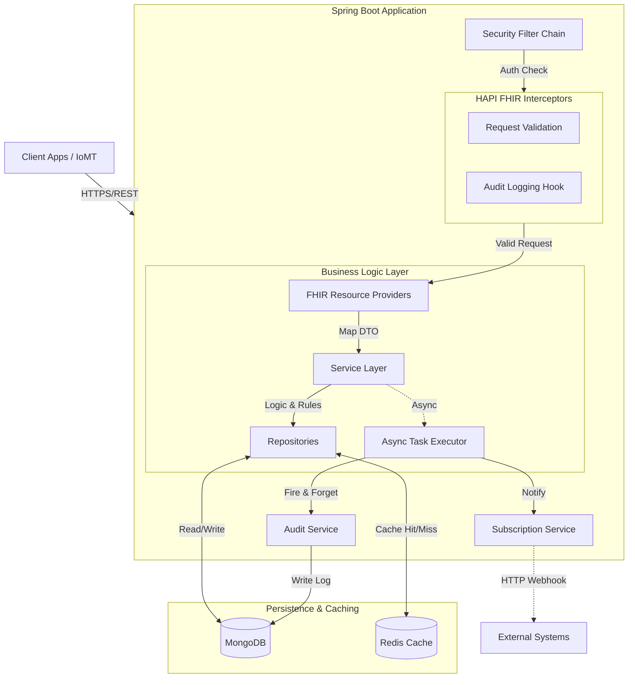
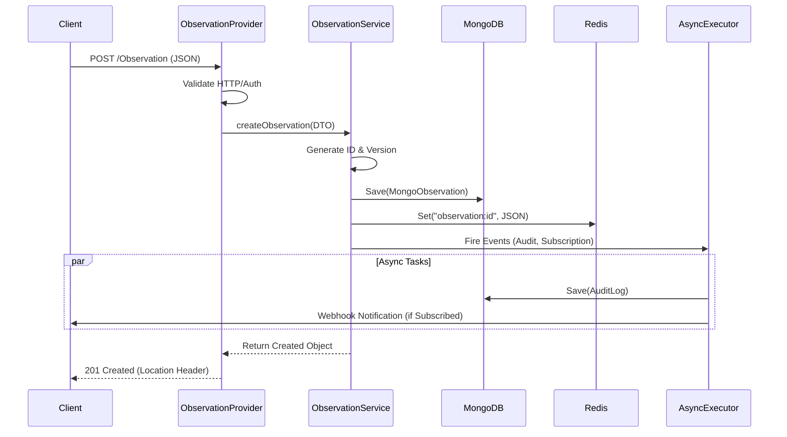

# LifeLog EHR Backend

## Overview & Domain

**Project Name**: LifeLog EHR Backend

**Description**: A high-performance, compliant Clinical Data Repository (CDR) built on the HL7 FHIR standard. It provides a robust backend for storing, retrieving, and managing clinical health data with sub-second latency and strict regulatory compliance features.

**Problem Statement**: Modern healthcare applications require interoperable, scalable, and secure storage for complex clinical data. Building a compliant backend from scratch is resource-intensive. LifeLog solves this by offering a pre-configured, standard-compliant FHIR server facade backed by NoSQL storage for flexibility and performance.

**Target Users**:
*   **Clinician Apps**: Mobile/Web apps for doctors to view patient history.
*   **Patient Portals**: Interfaces for patients to access their own records.
*   **IoMT Devices**: Wearables and sensors pushing vital signs (Observations).
*   **External Systems**: Insurance/Payer systems via standard FHIR APIs.

**Core Business Capabilities**:
*   **Clinical Data Management**: CRUD operations for Patients, Encounters, Conditions, Observations, Immunizations, etc.
*   **Semantic Interoperability**: Enforces HL7 FHIR R4 standard structures and terminologies (LOINC, SNOMED).
*   **Real-time Notifications**: Subscription-based webhooks for event-driven workflows.
*   **Audit & Compliance**: Immutable audit trails for every access and modification.

**Domain Model Overview**:
*   **Administrative**: `Patient`, `Practitioner`, `Organization`, `Appointment`.
*   **Clinical**: `Observation`, `Condition`, `Encounter`, `Immunization`, `MedicationRequest`, `DiagnosticReport`.
*   **Infrastructure**: `Subscription` (webhooks), `AuditEvent`.

---

## Architecture & Design

**Architecture Style**: **Modular Monolith (FHIR Facade)**.
The system is designed as a high-performance facade that strictly adheres to the HL7 FHIR standard while leveraging the flexibility of a document-oriented database. It follows a layered, event-driven architecture to ensure scalability and responsiveness.

### 🏗️ System Architecture Diagram



### 🧩 Component Details

1.  **Gateway & Security**:
    *   **Security Filter**: Handles Basic Authentication and protects private endpoints.
    *   **Interceptors**: The `SmartOnFhirInterceptor` and `RequestValidatingInterceptor` gatekeep requests, ensuring they are authorized and structurally valid (FHIR R4 compliant) before reaching business logic.

2.  **FHIR Facade (Providers)**:
    *   Acts as the **Controller Layer**. It parses incoming FHIR JSON/XML and maps standard FHIR operations (Create, Read, Search) to internal service calls.
    *   **Responsibility**: Protocol translation only; no business logic.

3.  **Service Layer (Domain Core)**:
    *   The heart of the application. It handles:
        *   **ID Generation**: UUID assignment for new resources.
        *   **Optimistic Locking**: Version checks to prevent lost updates.
        *   **Search Logic**: Mapping FHIR search parameters (e.g., `date=gt2024`) to MongoDB Queries.
        *   **Event Publishing**: Offloading side effects like auditing and webhooks.

4.  **Data Access & Caching**:
    *   **Write-Through Caching**: Data is written to MongoDB and immediately updated in Redis to ensure subsequent reads are fast and consistent.
    *   **MongoDB**: Stores resources as "Documents" containing metadata (indexes) + the raw `fhirJson` blob.

5.  **Event System (Async)**:
    *   Uses Spring's `@Async` and a `ThreadPoolTaskExecutor`.
    *   **Audit Service**: decoupling the mandatory logging from the critical path latency.
    *   **Subscription Service**: Evaluating criteria match and dispatching webhooks in the background.

### 🔄 Request Flow (Sequence Diagram)

The following diagram illustrates the lifecycle of a **Create Observation** request, highlighting the separation of synchronous (user-facing) and asynchronous (system) tasks.



### 🧠 Domain Service Responsibilities

| Service | Primary Responsibility | Key Interactions |
| :--- | :--- | :--- |
| **PatientService** | Manages Patient Identity & Demographics. | Validates uniqueness; indexed search by Name/Gender. |
| **ObservationService** | Handles Vitals, Labs, and Clinical results. | Links to `Patient`; Updates `Redis` cache; triggers `SubscriptionService`. |
| **SubscriptionService** | Manages Webhooks & Event dispatch. | Matches resources against active Subscription criteria (e.g., `category=vital-signs`). |
| **AuditService** | Records compliance logs. | Asynchronously writes to `audit_events` collection. |
| **ValidationService** | Enforces Business Rules. | Checks reference integrity (e.g., "Does Patient X exist?"). |

---

## Tech Stack & Dependencies

**Core**:
*   **Language**: Java 21 (LTS)
*   **Framework**: Spring Boot 3.x / 4.x
*   **Standard**: HAPI FHIR 6.x/8.x (R4)

**Data & Storage**:
*   **Database**: MongoDB 7.0 (Document Store)
*   **Cache**: Redis 7.2 (Key-Value Store)

**Infrastructure**:
*   **Containerization**: Docker, Docker Compose
*   **Build Tool**: Maven

**Libraries**:
*   **Lombok**: Boilerplate reduction.
*   **Micrometer**: Metrics instrumentation (Prometheus).

---

## Project Structure & Conventions

```
src/main/java/com/al/lifelog/
├── config/           # Spring & Lib configurations (Mongo, Redis, Security)
├── interceptor/      # Request interceptors (Audit, Auth)
├── model/            # MongoDB Entities (MongoPatient, MongoObservation)
├── provider/         # FHIR Resource Providers (Controllers)
├── repository/       # Spring Data MongoDB Repositories
├── service/          # Business Logic & Transaction Management
└── security/         # Security configurations
```

**Layering Rules**:
*   `Provider` can call `Service`.
*   `Service` can call `Repository` and other `Services`.
*   `Repository` accesses DB only.
*   **Dependency Direction**: Outer layers depend on inner layers.

**Error Handling**:
*   **Framework**: HAPI FHIR Global Exception Handlers.
*   **Mapping**:
    *   `ResourceNotFoundException` -> 404
    *   `UnprocessableEntityException` -> 422
    *   `AuthenticationException` -> 401
    *   Internal Errors -> 500 (OperationOutcome returned)

**Validation**:
*   **Input**: `RequestValidatingInterceptor` checks FHIR structural validity on POST/PUT.
*   **Business**: Service layer checks (e.g., date ranges, reference integrity).

---

## Configuration & Environments

**Environment Variables**:

| Variable | Description | Default |
| :--- | :--- | :--- |
| `SPRING_DATA_MONGODB_URI` | Connection string for MongoDB | `mongodb://mongo:27017/lifelog` |
| `SERVER_PORT` | Application Port | `8080` |
| `LOGGING_LEVEL_ROOT` | Log verbosity | `INFO` |

**Config Files**:
*   `application.yml`: Main configuration source.

**Secrets Management**:
*   Currently uses Environment Variables.
*   **Recommendation**: Use Docker Secrets or Vault for production.

---

## Setup, Installation & Local Development

**Prerequisites**:
*   Docker & Docker Compose
*   Java 21 JDK (optional if using Docker)
*   Maven 3.9+ (optional if using Docker)

**Quick Start (Docker)**:

1.  **Clone the repository**:
    ```bash
    git clone <repo-url>
    cd LifeLog
    ```

2.  **Start Services**:
    ```bash
    docker-compose up -d --build
    ```
    *   Starts Backend (8080)
    *   Starts MongoDB (27017)
    *   Starts Redis (6379)

3.  **Verify Status**:
    ```bash
    docker-compose ps
    ```

**Database**:
*   MongoDB initializes automatically.
*   Data is persisted in the `mongo-data` volume.

---

## Running & Operations

**Ports**:
*   **Local/Dev**: `http://localhost:8080`

**Health & Probes**:
*   **Liveness/Readiness**: `GET /actuator/health`
    *   Returns `200 OK` with status `UP` if DB and Redis are connected.

**Metrics**:
*   **Prometheus**: `GET /actuator/prometheus`
    *   Exposes `fhir_patient_created`, JVM metrics, HTTP latency.

**Shutdown**:
*   Supports graceful shutdown via Spring Boot (SIGTERM).

---

## API & Usage

**Base URL**: `http://localhost:8080/fhir`
**Authentication**: Basic Auth (`admin`/`password`).
**Response Format**: `application/fhir+json`

### 📚 API Reference & Endpoints

| Resource | Method | Path | Query Parameters / Body | Description & Usage |
| :--- | :--- | :--- | :--- | :--- |
| **Patient** | `POST` | `/Patient` | JSON Body (Patient resource) | Create a new Patient. Returns `201 Created` with `Location` header. |
| | `GET` | `/Patient/{id}` | N/A | Read Patient by ID. Returns `200 OK` or `404 Not Found`. |
| | `PUT` | `/Patient/{id}` | JSON Body | Update existing Patient. Uses optimistic locking via `@Version`. |
| | `DELETE` | `/Patient/{id}` | N/A | Soft-delete Patient. Checks for active references if enabled. |
| | `GET` | `/Patient/{id}/_history` | N/A | Retrieve version history of a Patient. |
| | `GET` | `/Patient` | `_id`, `name` (regex), `gender`<br>`_include=Patient:observation`<br>`_revinclude=Observation:patient` | Search Patients. Supports advanced inclusion/reverse inclusion of Observations. |
| **Observation** | `POST` | `/Observation` | JSON Body | Record clinical observations (Vitals, Labs). |
| | `GET` | `/Observation/{id}` | N/A | Read Observation by ID. |
| | `PUT` | `/Observation/{id}` | JSON Body | Update or correct an Observation. |
| | `GET` | `/Observation` | `subject` (Patient Ref), `code` (LOINC/SNOMED), `date` (Range)<br>`_include=Observation:patient` | Search with date ranges (e.g., `date=gt2024-01-01`). |
| **Encounter** | `POST` | `/Encounter` | JSON Body | Create a Visit/Encounter. |
| | `GET` | `/Encounter` | `subject` (Patient Ref), `date` (Range) | Find Encounters for a patient within a date range. |
| **Condition** | `POST` | `/Condition` | JSON Body | Record Diagnoses or Problems. |
| | `GET` | `/Condition` | `subject` (Patient Ref), `code` (SNOMED) | distinct `active` or `resolved` conditions by code. |
| **MedicationRequest** | `POST` | `/MedicationRequest` | JSON Body | Order medications. |
| | `GET` | `/MedicationRequest` | `subject` (Patient Ref) | List active medication orders for a patient. |
| **AllergyIntolerance**| `POST` | `/AllergyIntolerance`| JSON Body | Record allergies (Food, Drug, Enviro). |
| | `GET` | `/AllergyIntolerance`| `patient` (Patient Ref) | List known allergies. |
| **Appointment** | `POST` | `/Appointment` | JSON Body | Schedule future appointments. |
| | `GET` | `/Appointment` | `actor` (Patient/Practitioner Ref) | Find appointments for a specific person. |
| **DiagnosticReport** | `POST` | `/DiagnosticReport` | JSON Body | Store Lab/Imaging reports. |
| | `GET` | `/DiagnosticReport` | `subject`, `code` | Retrieve reports by patient and test type. |
| **Immunization** | `POST` | `/Immunization` | JSON Body | Record vaccinations. |
| | `GET` | `/Immunization` | `patient`, `vaccine-code` | List vaccination history. |
| **Organization** | `POST` | `/Organization` | JSON Body | Register Healthcare Orgs/Depts. |
| | `GET` | `/Organization` | `name` | Find Organizations by name. |
| **Practitioner** | `POST` | `/Practitioner` | JSON Body | Register Doctors/Nurses. |
| | `GET` | `/Practitioner` | `name` | Find Practitioners by name. |
| **Subscription** | `POST` | `/Subscription` | JSON Body (Criteria + Channel) | Register Webhook listeners (e.g., "Notify on new Observation"). |
| | `DELETE` | `/Subscription/{id}` | N/A | Unsubscribe from notifications. |
| **System** | `GET` | `/metadata` | N/A | **CapabilityStatement**: Lists all supported resources and interactions. |
| | `GET` | `/.well-known/smart-configuration`| N/A | SMART on FHIR discovery configuration. |


---

## Data & Persistence

**Data Model**:
*   **Storage Strategy**: Resources are stored as documents containing metadata fields + a full `fhirJson` string.
*   **Collections**:
    *   `patients`
    *   `observations`
    *   `encounters`
    *   `audit_events` (Audit Logs)

**Indexing**:
*   **Compound Indexes**: Example: `Patient` (family, given).
*   **Text Indexes**: For fuzzy search support.

**Retention**:
*   **Audit Logs**: Hard delete not implemented; assume indefinite retention for compliance.

---

## Security & Compliance

**Security Model**:
*   **Transport**: HTTPS required in production (TLS termination at ingress/LB).
*   **Authentication**: Interceptor-based checks. Public endpoints are explicitly allow-listed.

**Audit Logging**:
*   Every modify/access action is logged to `audit_events`.
*   **Fields**: Who (User/IP), What (Resource), When, Outcome.

**Input Sanitization**:
*   Strict FHIR parsing rejects malformed JSON or unknown fields.

---

## Testing & Quality

**Test Types**:
*   **Unit Tests**: JUnit 5 + Mockito. Focus on Service logic.
*   **Integration Tests**: Postman + Newman. Focus on HTTP/Controller layer and end-to-end flows.

**Run Tests Locally**:
```bash
# Unit Tests
mvn test

# Integration Tests (Requires server running)
newman run tests/postman/LifeLog_Integration_Tests.postman_collection.json -e tests/postman/LifeLog_Local.postman_environment.json
```

---

## Observability: Logging, Metrics, Tracing

**Logging**:
*   **Format**: Plain text / Console (Local).
*   **Levels**:
    *   `INFO`: Standard operations, startup.
    *   `ERROR`: Exceptions, validation failures.

**Metrics**:
*   Exposed via Micrometer/Actuator.
*   **Custom Metrics**:
    *   `fhir.patient.created` (Counter)
    *   `fhir.observation.created` (Counter)

---

## CI/CD, Deployment & Environments

**Environments**:
*   **Local**: Docker Compose (`localhost:8080`)
*   **Dev/Staging**: (Placeholder)
*   **Production**: (Placeholder)

**Deployment Strategy**:
*   **Container**: Build Docker image -> Push to Registry -> Deploy to Orchestrator (K8s/ECS).

---

## Integrations & External Systems

*   **Subscribers**: Any external system registering a `rest-hook` Subscription.
    *   **Retry Policy**: Basic try/catch (Currently). Recommended to implement exponential backoff via Queue.

---

## Governance, Ownership & Future Work

**Owner**: Engineering Team (LifeLog)

**Roadmap**:
*   [ ] OAuth2 / SMART on FHIR full compliance.
*   [ ] Advanced Search Parameters (Chained params).
*   [ ] Terminology Server Integration.
*   [ ] Bulk Data Export ($export).
