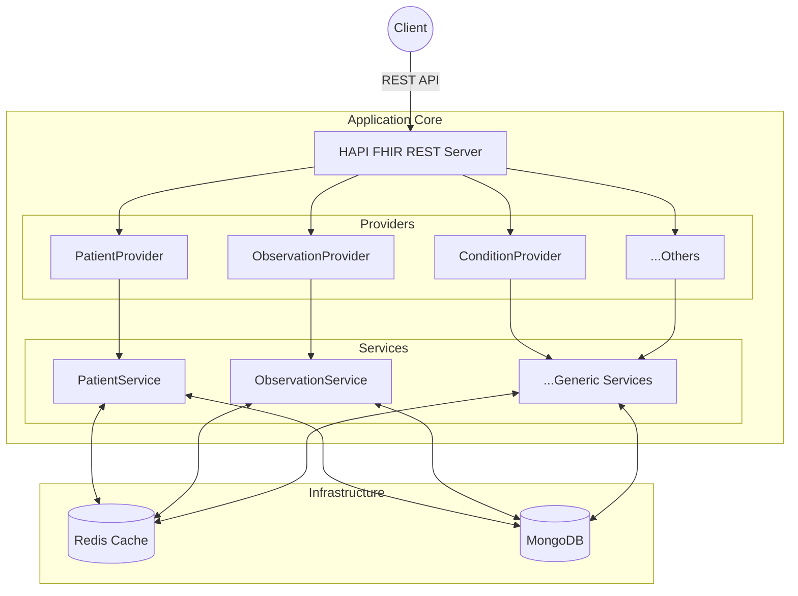
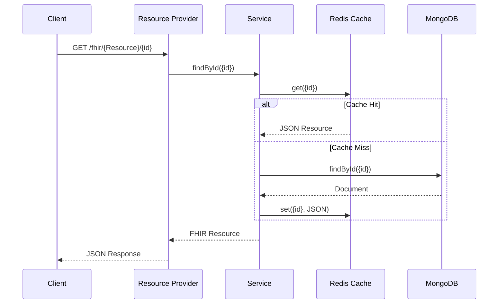

# LifeLog EHR Backend

A Clinical Data Backend built with **Spring Boot 4**, **HAPI FHIR**, **MongoDB**, and **Redis**.

This project implements a **HAPI FHIR Facade** architecture, enabling standard FHIR resources to be stored as JSON documents in MongoDB, with high-performance caching via Redis.

## 🚀 Tech Stack

- **Java**: 21
- **Framework**: Spring Boot 4.0.0
- **FHIR Standard**: HAPI FHIR 8.6.1 (R4 Model)
- **Database**: MongoDB (Stores raw FHIR JSON)
- **Cache**: Redis (Key-Value cache for Resources)
- **Containerization**: Docker & Docker Compose

## 🛠️ Architecture

Unlike the standard HAPI FHIR JPA Server (which requires SQL), **LifeLog** uses a "Plain Server" approach where custom Resource Providers delegate to a MongoDB repository.

### High-Level Components



### Request Flow

1.  **Request**: `GET /fhir/Patient/123`
2.  **Provider**: `PatientResourceProvider` intercepts the request.
3.  **Service**: `PatientService` checks **Redis**.
    -   *Hit*: Returns cached JSON.
    -   *Miss*: Fetches from **MongoDB**, caches result in Redis, and returns.
4.  **Response**: Standard FHIR JSON.



## 📂 Project Structure

```text
src/main/java/com/lifelog/ehr
├── config/       # Spring & HAPI FHIR Configuration
├── model/        # MongoDB Data Models (Custom Wrappers)
├── provider/     # REST Controllers (FHIR Resource Providers)
├── repository/   # Spring Data MongoDB Repositories
└── service/      # Business Logic & Caching Layer
```

## 💾 Database Design

LifeLog uses a **Hybrid Data Model** in MongoDB to balance strict standard compliance with search performance.

### Schema Strategy
Instead of fully decomposing FHIR resources into hundreds of tables (SQL style) or complex nested sub-documents, we use a **"Raw + Index"** approach:

1.  **Raw Fidelity (`fhirJson`)**: The entire FHIR Resource is serialized to a string and stored in a `fhirJson` field. This ensures 100% data fidelity, handling complex nesting and polymorphism without schema headaches.
2.  **Search Indexes**: Key fields required for searching (e.g., `patient_id`, `gender`, `status`) are extracted and promoted to top-level fields in the MongoDB document. These fields are indexed for O(1) or O(log n) lookup speeds.

### Example: Patient Collection (`patients`)

| Field | Type | Description |
| :--- | :--- | :--- |
| `_id` | String | The Logical ID of the resource (e.g., "123"). |
| `fhirJson` | String | The full JSON representation (`{"resourceType":"Patient", ...}`). |
| `family` | String | **(Indexed)** Last Name for searching. |
| `given` | String | **(Indexed)** First Name for searching. |
| `gender` | String | **(Indexed)** Administrative Gender. |

### Example: Observation Collection (`observations`)

| Field | Type | Description |
| :--- | :--- | :--- |
| `_id` | String | The Logical ID of the observation. |
| `fhirJson` | String | Full JSON content. |
| `subjectId` | String | **(Indexed)** Reference to the Patient (e.g., "Patient/123"). |
| `code` | String | **(Indexed)** The LOINC/SNOMED code (e.g., "85354-9" for Blood Pressure). |

## 🧩 Low Level Design (LLD)

The application follows a strict layered architecture to separate concerns.

### 1. Resource Providers (Controller Layer)
*   **Role**: Entry point for HTTP requests. Implements HAPI FHIR interfaces (e.g., `IResourceProvider`).
*   **Responsibility**:
    *   Parse incoming parameters.
    *   Delegate business logic to Services.
    *   Do **not** contain business logic or DB access code.

### 2. Service Layer (Business Logic)
*   **Role**: The coordinator.
*   **Responsibility**:
    *   **Caching Strategy (Read-Through)**:
        1.  Check Redis for `Key: {ResourceType}:{ID}`.
        2.  If **Hit**, return immediately.
        3.  If **Miss**, query Repository -> store in Redis (TTL 10m) -> return.
    *   **Write Strategy (Write-Through)**:
        1.  Convert FHIR Object -> JSON String.
        2.  Extract Index fields (e.g., extract `Patient.name` -> `MongoPatient.family`).
        3.  Save to MongoDB.
        4.  Update Redis cache immediately.

### 3. Repository Layer (Data Access)
*   **Role**: Abstraction over MongoDB.
*   **Technology**: Spring Data MongoDB (`MongoRepository`).
*   **Responsibility**:
    *   Provide standard CRUD operations.
    *   Define custom finders for indexed fields (e.g., `findBySubjectId`).

## 📦 How to Run

### Option 1: Docker (Recommended)
Orchestrates the App, MongoDB, and Redis automatically.

```bash
docker-compose up --build
```
- API: `http://localhost:8080/fhir`
- Mongo: `localhost:27017`
- Redis: `localhost:6379`

### Option 2: Local Maven
Requires locally running MongoDB and Redis.

```bash
mvn spring-boot:run
```

## 🔗 API Endpoints

Base URL: `http://localhost:8080/fhir`

### Patient Resource

| Method | Endpoint | Description |
| :--- | :--- | :--- |
| **POST** | `/Patient` | Create a new Patient |
| **GET** | `/Patient/{id}` | Retrieve a Patient by ID |
| **GET** | `/Patient?name={name}` | Search by Family or Given name (Partial match) |
| **GET** | `/Patient?gender={code}` | Search by Administrative Gender (e.g., `male`) |

### Clinical Resources

| Method | Endpoint | Description |
| :--- | :--- | :--- |
| **POST** | `/Observation` | Record Vitals/Labs |
| **GET** | `/Observation?subject={id}` | Get Vitals for Patient |
| **POST** | `/Condition` | Record Diagnoses (e.g. Diabetes) |
| **GET** | `/Condition?subject={id}` | Get Diagnoses for Patient |
| **POST** | `/Encounter` | Record Visits |
| **GET** | `/Encounter?subject={id}` | Get Encounters for Patient |
| **POST** | `/MedicationRequest` | Prescribe Medications |
| **GET** | `/MedicationRequest?subject={id}` | Get Prescriptions for Patient |
| **POST** | `/AllergyIntolerance` | Record Allergies |
| **GET** | `/AllergyIntolerance?patient={id}` | Get Allergies for Patient |
| **POST** | `/Appointment` | Schedule Appointments |
| **GET** | `/Appointment?actor={id}` | Get Appointments for Patient |

### Example Payloads

**Create Patient**
```json
POST /fhir/Patient
{
  "resourceType": "Patient",
  "name": [
    {
      "family": "Doe",
      "given": ["John"]
    }
  ],
  "gender": "male",
  "birthDate": "1990-01-01"
}
```

**Record Condition (Diagnosis)**
```json
POST /fhir/Condition
{
  "resourceType": "Condition",
  "clinicalStatus": {
    "coding": [{ "system": "http://terminology.hl7.org/CodeSystem/condition-clinical", "code": "active" }]
  },
  "code": {
    "coding": [{ "system": "http://snomed.info/sct", "code": "73211009", "display": "Diabetes mellitus" }]
  },
  "subject": { "reference": "Patient/123" }
}
```

**Record Encounter (Visit)**
```json
POST /fhir/Encounter
{
  "resourceType": "Encounter",
  "status": "finished",
  "class": {
    "system": "http://terminology.hl7.org/CodeSystem/v3-ActCode",
    "code": "AMB",
    "display": "ambulatory"
  },
  "subject": { "reference": "Patient/123" }
}
```

**Record Medication Request (Prescription)**
```json
POST /fhir/MedicationRequest
{
  "resourceType": "MedicationRequest",
  "status": "active",
  "intent": "order",
  "medicationCodeableConcept": {
    "coding": [{ "system": "http://www.nlm.nih.gov/research/umls/rxnorm", "code": "1049630", "display": "Amoxicillin 500 MG" }]
  },
  "subject": { "reference": "Patient/123" },
  "requester": { "reference": "Practitioner/555" }
}
```

**Record Allergy Intolerance**
```json
POST /fhir/AllergyIntolerance
{
  "resourceType": "AllergyIntolerance",
  "clinicalStatus": {
    "coding": [{ "system": "http://terminology.hl7.org/CodeSystem/allergyintolerance-clinical", "code": "active" }]
  },
  "verificationStatus": {
    "coding": [{ "system": "http://terminology.hl7.org/CodeSystem/allergyintolerance-verification", "code": "confirmed" }]
  },
  "code": {
    "coding": [{ "system": "http://snomed.info/sct", "code": "373270004", "display": "Penicillin" }]
  },
  "patient": { "reference": "Patient/123" }
}
```

**Schedule Appointment**
```json
POST /fhir/Appointment
{
  "resourceType": "Appointment",
  "status": "booked",
  "description": "Follow-up checkup",
  "start": "2024-03-20T09:00:00Z",
  "end": "2024-03-20T10:00:00Z",
  "participant": [
    {
      "actor": { "reference": "Patient/123" },
      "status": "accepted"
    },
    {
      "actor": { "reference": "Practitioner/555" },
      "status": "accepted"
    }
  ]
}
```

## ⚙️ Configuration

The application is configured via `application.yml` and supports environment variables for containerized deployments.

| Variable | Default | Description |
| :--- | :--- | :--- |
| `SPRING_DATA_MONGODB_URI` | `mongodb://localhost:27017/lifelog` | Connection string for MongoDB. |
| `SPRING_DATA_REDIS_HOST` | `localhost` | Hostname for the Redis server. |
| `SERVER_PORT` | `8080` | Port the application runs on. |

## 🔐 Security & SMART on FHIR

LifeLog implements **SMART on FHIR** using **OAuth2** and **OpenID Connect**.
- **Identity Provider**: Keycloak accounts for authentication.
- **Resource Server**: Spring Security validates JWT tokens.
- **Authorization**: HAPI FHIR Interceptor enforces scopes (e.g., `patient/*.read`).

### Keycloak Setup
The `docker-compose.yml` includes a Keycloak instance at `http://localhost:8180`.
- **Admin**: `admin` / `admin`
- **Realm**: A `lifelog` realm should be created.
- **Client**: Create an `openid-connect` client (e.g., `postman` or `react-app`) with `Access Type: public`.

### Endpoints
- **Discovery**: `GET /.well-known/smart-configuration`
- **Metadata**: `GET /fhir/metadata` (Public)
- **Protected Resources**: `GET /fhir/Patient`, etc. (Requires `Authorization: Bearer <jwt>`)

## ⚠️ Current Limitations

- **Validation**: Validation is primarily structural. Semantic validation (e.g., checking if a SNOMED code exists in a ValueSet) is not yet enforced.
- **Transactions**: MongoDB transactions are not enabled by default; operations are atomic at the document level.

## 🗺️ Roadmap

- [x] **Auth**: Implement Smart-on-FHIR (OAuth2 + OpenID Connect).
- [ ] **UI**: Build a Clinician Dashboard using Next.js/React.
- [ ] **IoMT**: Integrate with Wearables (Apple Health, Google Fit) for continuous observation tracking.
- [ ] **Analytics**: Add a population health dashboard using MongoDB Charts.

## 🛠️ Troubleshooting

**Issue**: `Port 8080 already in use`
- **Fix**: Stop other services or change `SERVER_PORT` in `docker-compose.yml`.

**Issue**: Redis Connection Failure
- **Fix**: Ensure the Redis container is healthy. If running locally without Docker, ensure Redis is installed and running on port 6379.

## 🧪 Testing

Run unit tests (Services + Controllers) with Maven:

```bash
mvn test
```
