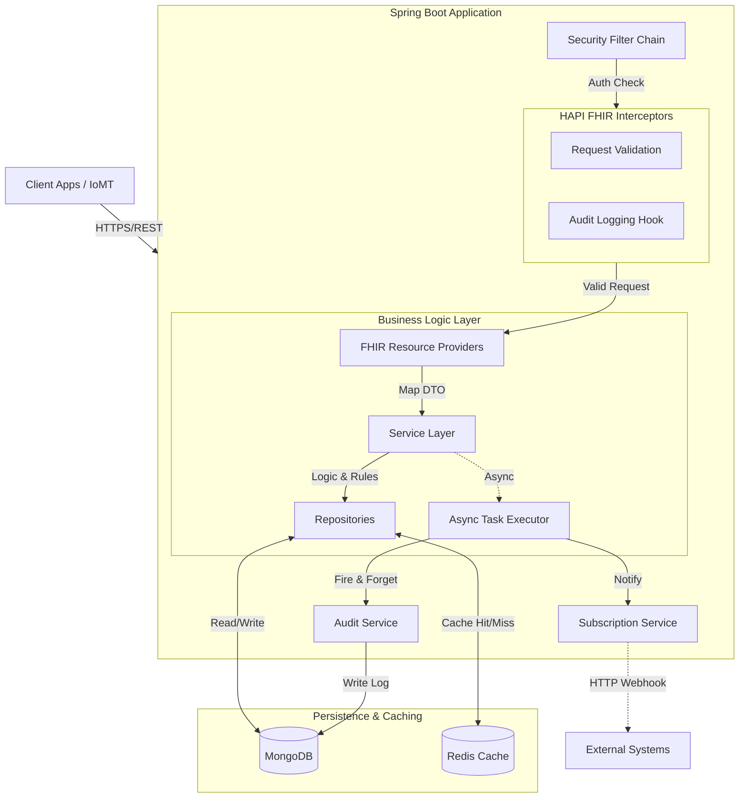

<div align="center">

# LifeLog EHR Backend
### High-Performance Clinical Data Repository (CDR)

[](https://openjdk.org/projects/jdk/21/)
[](https://spring.io/projects/spring-boot)
[](https://redis.io/)
[](https://www.mongodb.com/)
[](https://www.docker.com/)
[](LICENSE)

*Built on the [HL7 FHIR R4](http://hl7.org/fhir/R4/) Standard*

</div>

---

## 📋 Table of Contents
- [Executive Summary](#-executive-summary)
- [Business Logic & Capabilities](#-business-logic--capabilities)
- [Security & Access Control](#-security--access-control)
- [Architecture & Design](#-architecture--design)
  - [System Architecture](#system-architecture-diagram)
  - [Date Persistence & Integrity](#data-persistence--integrity)
- [Technology Stack](#-technology-stack)
- [Getting Started](#-getting-started)
- [API Reference](#-api-reference)
- [Operations Manual](#-operations-manual)
- [Developer Guide](#-developer-guide)
- [Roadmap](#-roadmap)

---

## 📝 Executive Summary

**LifeLog EHR Backend** is a purpose-built, compliant backend component for modern Electronic Health Record (EHR) systems. It solves the complexity of building a healthcare data platform from scratch by providing a pre-configured **FHIR Facade** that is secure, scalable, and interoperable out of the box.

Unlike traditional SQL-based EHRs, LifeLog leverages **MongoDB** to natively store FHIR JSON documents, offering superior flexibility for diverse clinical data types, while maintaining strict ACID compliance and validation rules.

**Target Use Cases**:
*   **Clinician Dashboards**: Real-time access to patient vitals and history.
*   **IoMT Data Ingestion**: High-throughput writes from wearables.
*   **Patient Portals**: Secure, granular access for patients.

---

## 🩺 Business Logic & Capabilities

### FHIR Resource Management
The system supports specific Clinical and Administrative modules. Each module implements strict semantic validation against the FHIR R4 specification.

| Module | Resource Type | Key Business Rules |
| :--- | :--- | :--- |
| **Patient Administration** | `Patient` | **Write**: Restricted to Registrars.<br>**Read**: Clinical staff.<br>**Search**: Token/String search on Name, Gender.<br>**Versioning**: Full history maintained. |
| **Clinical Observations** | `Observation` | **High Volume**: Optimized for IoMT ingestion.<br>**Caching**: Aggressive caching (10 min TTL).<br>**Notifications**: Triggers `Subscription` webhooks on create. |
| **Encounters & Visits** | `Encounter` | Links interactions between Patient and Practitioner.<br>**Integrity**: Must reference valid Patient/Practitioner IDs. |
| **Conditions (Diagnosis)** | `Condition` | Tracks current and historical problems.<br>**Security**: Sensitive access (Physician/Nurse/Biller only). |
| **Medications** | `MedicationRequest` | **Prescribing**: Restricted to Physicians.<br>**Dispensing**: Visible to Pharmacists. |
| **Diagnostics** | `DiagnosticReport` | Lab results integration.<br>**Write**: Restricted to Lab Techs. |
| **Scheduling** | `Appointment` | **Self-Service**: Patients can book (create) own appointments.<br>**Management**: Schedulers manage slots. |

---

## 🛡️ Security & Access Control

The system uses a **Maximum Granularity** authority model. Users are not checked for "Roles" (e.g. `PHYSICIAN`) in the code, but for "Authorities" (e.g. `OBSERVATION_WRITE`). This allows purely configuration-based role changes without code refactoring.

### Active Role-Authority Matrix

#### Clinical Roles
| Role | Username | Authorities (Capabilities) |
| :--- | :--- | :--- |
| **Physician** | `physician` | `PATIENT_READ`, `OBSERVATION_WRITE`, `CONDITION_WRITE`, `ENCOUNTER_WRITE`, `MEDICATION_WRITE`, `ALLERGY_WRITE`, `IMMUNIZATION_WRITE`, `DIAGNOSTIC_READ` |
| **Nurse** | `nurse` | `PATIENT_READ`, `OBSERVATION_WRITE`, `CONDITION_READ`, `ENCOUNTER_READ`, `IMMUNIZATION_WRITE`, `MEDICATION_READ` |
| **Pharmacist** | `pharmacist` | `PATIENT_READ`, `MEDICATION_READ`, `ALLERGY_READ` |
| **Lab Tech** | `lab_tech` | `SERVICE_ORDER_READ`, `DIAGNOSTIC_WRITE`, `OBSERVATION_WRITE` |

#### Administrative Roles
| Role | Username | Authorities (Capabilities) |
| :--- | :--- | :--- |
| **Registrar** | `registrar` | `PATIENT_WRITE` (Create/Update), `APPOINTMENT_WRITE`, `COVERAGE_WRITE` |
| **Scheduler** | `scheduler` | `APPOINTMENT_WRITE`, `SCHEDULE_WRITE`, `PRACTITIONER_READ` |
| **Biller** | `biller` | `ENCOUNTER_READ`, `CONDITION_READ`, `ACCOUNT_WRITE` |
| **Practice Mgr** | `practice_mgr` | `PRACTITIONER_WRITE`, `ORGANIZATION_WRITE`, `LOCATION_WRITE` |

#### System Roles
| Role | Username | Authorities (Capabilities) |
| :--- | :--- | :--- |
| **SysAdmin** | `sys_admin` | `SUBSCRIPTION_WRITE`, `SYSTEM_CONFIG_WRITE` |
| **Auditor** | `auditor` | `AUDIT_READ` (ReadOnly access to Audit Logs) |
| **Integrator** | `integrator` | `OBSERVATION_WRITE` (Headless IoMT ingestion) |
| **Patient** | `patient_user` | `PATIENT_SELF_READ` (Access to own record only) |

### Audit Logging
*   **Secure & Immutable**: Every Write (Create/Update/Delete) and specific Reads are logged.
*   **Storage**: `audit_event` collection in MongoDB.
*   **Fields Logged**: Timestamp, User ID, Resource Type, Resource ID, Operation, Outcome.
*   **Access**: strictly limited to `AUDITOR` role.

---

## 🏗 Architecture & Design

**Style**: Modular Monolith (FHIR Facade)

The system behaves as a protocol translator:
1.  **Ingest**: Receives standard FHIR REST requests.
2.  **Process**: Validates logic, enforces rules, and generates events.
3.  **Persist**: Stores data as optimized Documents (MongoDB) and KV pairs (Redis).

### System Architecture Diagram



### Data Persistence & Integrity
*   **Optimistic Locking**: The system implements standard FHIR Versioning.
    *   Every update requires a version check. If the client sends `If-Match: W/"2"` and the current server version is `3`, the request fails with `412 Precondition Failed`.
    *   **Goal**: prevents "lost updates" when multiple clinicians edit a record simultaneously.
*   **Versioning**:
    *   Every update creates a historical copy in the `_history` collection.
    *   Accessible via `GET /{Resource}/{id}/_history`.

### Caching Strategy (Redis)
*   **Pattern**: Cache-Aside / Write-Through.
*   **TTL**: 10 Minutes default.
*   **Invalidation**:
    *   **Update/Delete**: Immediately invalidates the cache key to ensure consistency.
    *   **Search**: Searches always hit the primary database (MongoDB) to ensure accuracy, they are *not* cached.

### Event Driven Architecture
*   **Subscriptions**: The system supports FHIR `Subscription` resources (REST Hook).
*   **Trigger**: When a resource is Created/Updated, the `SubscriptionService` evaluates active subscriptions.
*   **Delivery**: Asynchronous POST request to the subscriber's endpoint.

---

## 💻 Technology Stack

| Component | Technology | Version | Purpose |
| :--- | :--- | :--- | :--- |
| **Core** | Java | 21 (LTS) | Language |
| **Framework** | Spring Boot | 3.x / 4.x | App Framework |
| **Standard** | HAPI FHIR | R4 | FHIR Parsing & Logic |
| **Database** | MongoDB | 7.0 | Document Store |
| **Cache** | Redis | 7.2 | Performance Layer |
| **Build** | Maven | 3.9+ | Dependency Management |
| **Ops** | Docker | Latest | Containerization |

---

## 🏁 Getting Started

### Prerequisites
*   **Docker Desktop** (Engine 20.10+)
*   **Git**

### Quick Start (with Docker)
Run the entire stack (App + Mongo + Redis) in one command:

```bash
# 1. Clone Repo
git clone https://github.com/al-das/lifelog-server.git
cd lifelog-server

# 2. Start Stack
docker-compose up -d --build

# 3. Verify (Wait ~30s for startup)
curl http://localhost:8080/actuator/health
# Expected: {"status":"UP"}
```

### Manual Build
If you prefer running without Docker:
```bash
# Ensure local Mongo (27017) and Redis (6379) are running
mvn clean install
java -jar target/lifelog-ehr-0.0.1-SNAPSHOT.jar
```

### ✅ Verification
After starting the server, you can verify the Role-Based Access Control (RBAC) configuration using the included PowerShell script. This script tests various endpoints with different user roles to ensure permissions are correctly enforced.

```powershell
./verify_rbac.ps1
```

---

## 📚 API Reference

**Base URL**: `http://localhost:8080/fhir`

> [!TIP]
> All resources support `_format=json`, `_pretty=true`, `_count={n}`, and `_offset={n}` parameters.

### 1. Patient Scenarios (Role: **Admin**)
| Method | Endpoint | Params | Description |
| :--- | :--- | :--- | :--- |
| `POST` | `/Patient` | N/A | Create a new patient. |
| `GET` | `/Patient/{id}` | N/A | Read patient details. |
| `GET` | `/Patient` | `name`, `gender`, `_id` | Search patients. |
| `PUT` | `/Patient/{id}` | N/A | Update patient record. |
| `DELETE` | `/Patient/{id}` | N/A | Delete patient record. |
| `GET` | `/Patient/{id}/_history` | N/A | Retrieve version history. |

### 2. Clinical Resources (Role: **Clinical**)
| Resource | Methods | Endpoint | Supported Search Params |
| :--- | :--- | :--- | :--- |
| **Observation** | `GET`, `POST`, `PUT`, `DELETE` | `/Observation` | `subject`, `code`, `date` |
| **Condition** | `GET`, `POST`, `PUT`, `DELETE` | `/Condition` | `subject`, `code` |
| **Encounter** | `GET`, `POST`, `PUT`, `DELETE` | `/Encounter` | `subject`, `date` |
| **AllergyIntolerance**| `GET`, `POST` | `/AllergyIntolerance` | `patient` |
| **MedicationRequest** | `GET`, `POST` | `/MedicationRequest` | `subject` |
| **DiagnosticReport** | `GET`, `POST` | `/DiagnosticReport` | `subject`, `code` |

### 3. Administrative Resources (Role: **Admin**)
| Resource | Methods | Endpoint |
| :--- | :--- | :--- |
| **Practitioner** | `GET`, `POST` | `/Practitioner` |
| **Organization** | `GET`, `POST` | `/Organization` |
| **Appointment** | `GET`, `POST` | `/Appointment` |
| **Subscription** | `POST`, `DELETE` | `/Subscription` |

---

## ⚙️ Operations Manual

### Configuration
Key environment variables in `application.yml`:

| Variable | Description | Default |
| :--- | :--- | :--- |
| `SPRING_DATA_MONGODB_URI` | Mongo Connection String | `mongodb://localhost:27017/lifelog` |
| `SPRING_REDIS_HOST` | Redis Server Host | `localhost` |
| `SERVER_PORT` | Application HTTP Port | `8080` |

### Observability
*   **Metrics**: Prometheus scraper available at `/actuator/prometheus`.
*   **Logging**: STDOUT (Docker Logs).

### Troubleshooting Common Issues

<details>
<summary><strong>❌ 403 Forbidden</strong></summary>

**Cause**: The user role lacks the specific **Authority** for that HTTP Method + Resource.
**Fix**: Check `SecurityConfig.java` against the user's role. e.g., A `Nurse` cannot *Write* a `MedicationRequest`.
</details>

<details>
<summary><strong>❌ 412 Precondition Failed</strong></summary>

**Cause**: Optimistic Locking conflict. Another user updated the record since you read it.
**Fix**: Re-read the resource to get the latest `versionId`, re-apply changes, and submit again.
</details>

<details>
<summary><strong>❌ MongoSocketOpenException</strong></summary>

Ensure the `mongo` container is healthy. If running locally (not Docker), change connection string to `localhost:27017`.
</details>

---

## 💻 Developer Guide

### Project Structure
```
src/main/java/com/al/lifelog/
├── config/           # App Configuration (SecurityConfig, FhirConfig)
├── interceptor/      # AOP Interceptors (Audit, Validation)
├── model/            # Mongo Documents & DTOs
├── provider/         # FHIR Resource Providers (Controllers)
├── repository/       # Spring Data MongoDB Repositories
├── service/          # Business Logic & Service Layer
└── tests/
    └── postman/      # Integration Tests & Environment Files
```

### Adding a New Resource
1.  **Model**: Create Class extending `DomainResource`. Application `Mongo{Resource}` wrapper.
2.  **Repo**: Create `CodeRepository` interface.
3.  **Service**: Implement CRUD logic, Caching, and Auditing calls.
4.  **Provider**: Extend `IResourceProvider`, expose `@Create`, `@Read`, etc.
5.  **Config**: Register Provider in `FhirRestfulServerConfig`.
6.  **Security**: Define authorities in `SecurityConfig`.

### Running Tests
```bash
mvn test
# Integration Tests via Postman
newman run tests/postman/LifeLog_Integration_Tests.postman_collection.json ...
```

---

## 🗺 Roadmap

- [x] **Core FHIR Resources** (Patient, Obs, Condition, etc.)
- [x] **Advanced Search** (Chained Parameters)
- [x] **Role-Based Access Control (RBAC)**
- [x] **Docker Support**
- [ ] **OAuth2 / SMART on FHIR Compliance**
- [ ] **Terminology Services** (Validation against LOINC/SNOMED)
- [ ] **Bulk Export ($export)**

---

## 📜 License

This project is licensed under the MIT License - see the [LICENSE](LICENSE) file for details.

---

<div align="center">
    <sub>Maintained by the LifeLog Engineering Team.</sub>
</div>
